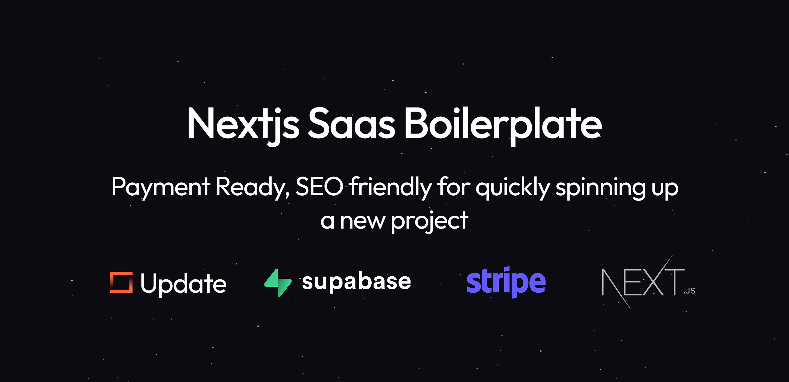
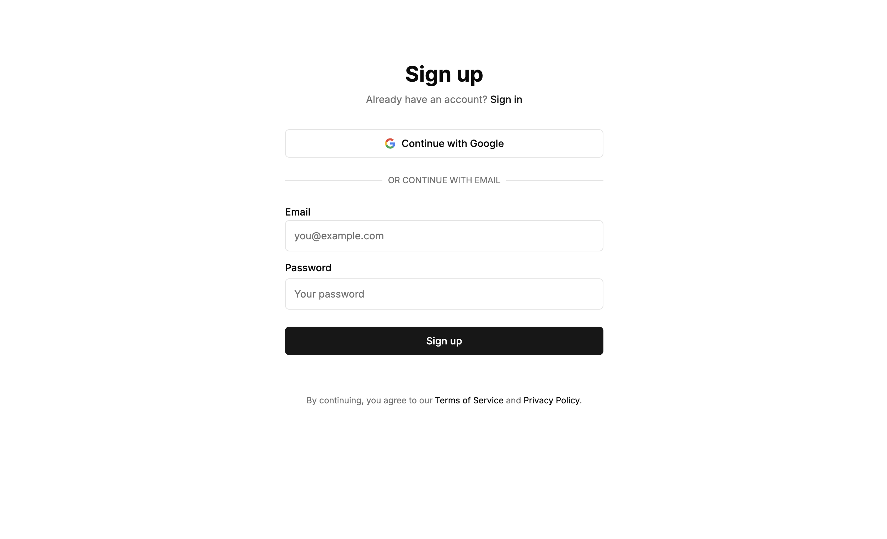
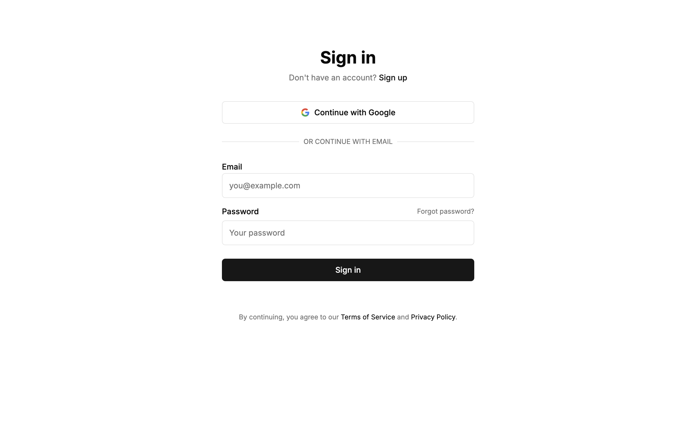
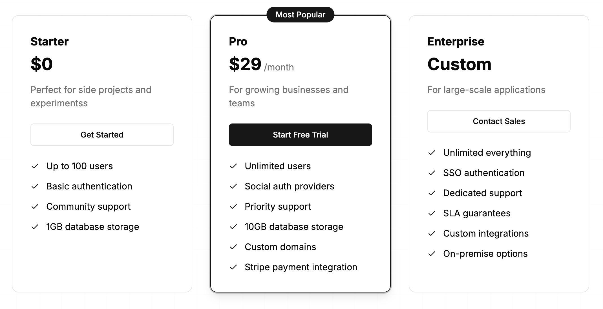

# Next.js Payment-Ready SaaS Template - Complete Monetization Boilerplate

[](https://nextjs.org)
[](https://www.typescriptlang.org)
[](https://tailwindcss.com)
[](https://supabase.com)
[](https://stripe.com)
[](https://update.dev)



🚀 The ultimate Next.js 15 SaaS boilerplate for indie hackers and startups. Start charging customers immediately with built-in Stripe payments, Supabase auth, Update.dev billing, and premium content gating. Everything you need to launch your monetized application in hours, not weeks.

⚡️ Built with developer experience in mind: Next.js 15 + TypeScript + Tailwind CSS + Supabase + Update.dev + Stripe + ESLint + Prettier ✨

🚀 Launch your SaaS faster with this production-ready Next.js 15 monetization template. Built for developers who need a complete payment system, subscription management, and user authentication out of the box.

⚡️ Everything you need to start charging customers: Stripe integration, Supabase auth, Update.dev billing and auth wrapper, premium content gating, and beautiful Tailwind UI components. Perfect for indie hackers and startups building monetized applications.

## 🎮 Demo

### Live demo: [Coming Soon](https://update.dev)

<div align="center">
  <table>
    <tr>
      <th>Sign Up</th>
      <th>Sign In</th>
    </tr>
    <tr>
      <td width="50%">
        
      </td>
      <td width="50%">
        
      </td>
    </tr>
  </table>

  <h3>Pricing Page</h3>
  
</div>

## ✨ Key Features

### 🚀 Modern Tech Stack
- **Next.js 15** with App Router for blazing-fast performance
- **TypeScript** for type-safe development
- **Tailwind CSS 4** for beautiful, responsive design
- **Supabase** for authentication and database
- **Stripe** for subscription management
- **Update** for unified billing, authentication, and entitlement management

### 🔐 Authentication & Security
- Email/Password authentication
- Google OAuth integration
- Secure session management
- Protected routes and middleware
- Email confirmation flow
- Update-powered auth flow management

### 💳 Subscription Management
- Pre-configured subscription plans
- Stripe integration
- Customer portal
- Secure payment processing
- Update-powered entitlement management

### 🎨 UI/UX Features
- Responsive dashboard layout
- Mobile-first design
- Loading states and spinners
- Error boundaries
- Custom error messages
- Dark mode support with automatic system preference detection
- Smooth theme transitions
- Consistent color scheme across light and dark modes

## 🚀 Getting Started

### Prerequisites
- Node.js 18.17 or later
- npm or yarn
- Supabase account
- Stripe account
- Update.dev account

### Installation

1. Create accounts on required services:
   - [Update.dev](https://update.dev)
   - [Supabase](https://supabase.com)
   - [Stripe](https://stripe.com)

2. Clone the repository:
```bash
git clone https://github.com/wyattm14/launch-saas-stripe-nextjs-supabase-update.git
cd boilerplate
```

3. Install dependencies:
```bash
npm install
# or
yarn install
```

4. Set up environment variables:
```bash
cp .env.local.example .env.local
```

5. Configure Update.dev:
   - Go to [Update Dashboard](https://update.dev/dashboard)
   - Create an entitlement (e.g., "pro" for premium features)
   - Create a product that matches the entitlement (e.g., "Pro Plan" for $10/month)
   - Copy your Update public key

6. Update the environment variables in `.env.local` with your credentials:
```env
# Update Configuration
NEXT_PUBLIC_UPDATE_PUBLIC_KEY=your_update_public_key
NEXT_PUBLIC_SUPABASE_URL=your_supabase_url
NEXT_PUBLIC_SUPABASE_ANON_KEY=your_supabase_anon_key
NEXT_PUBLIC_SITE_URL=http://localhost:3000
```

7. Run the development server:
```bash
npm run dev
# or
yarn dev
```

## 📚 Documentation

For detailed documentation, visit:
- [Update Documentation](https://update.dev/docs)
- [Supabase Documentation](https://supabase.com/docs)
- [Stripe Documentation](https://stripe.com/docs)
- [Next.js Documentation](https://nextjs.org/docs)

## 🧩 Project Structure

```
.
├── app/                             # Next.js App Router
│   ├── (auth)/                     # Authentication routes
│   ├── api/                        # API routes
│   │   ├── generator/              # Cat API integration
│   │   └── webhook/                # Stripe webhook handler
│   ├── protected/                  # Protected dashboard routes
│   │   ├── paid-content/          # Premium content page
│   │   ├── pricing/               # Pricing page
│   │   └── subscription/          # Subscription management
│   ├── pricing/                    # Public pricing page
│   ├── actions.ts                  # Server actions
│   ├── error.tsx                   # Error boundary
│   ├── globals.css                 # Global styles
│   ├── layout.tsx                  # Root layout
│   └── page.tsx                    # Home page
├── components/                     # React components
│   ├── dashboard/                  # Dashboard components
│   ├── ui/                         # UI components
│   ├── auth-submit-button.tsx      # Authentication button
│   ├── error-boundary.tsx          # Error boundary component
│   ├── error-message.tsx           # Error message component
│   ├── form-message.tsx            # Form message component
│   ├── free-plan-card.tsx          # Free plan card
│   ├── google-sign-in-button.tsx   # Google sign-in button
│   ├── header.tsx                  # Header component
│   ├── pricing-card.tsx            # Pricing card component
│   ├── pricing-content.tsx         # Pricing content
│   ├── protected-sidebar.tsx       # Protected sidebar
│   └── subscription-actions.tsx    # Subscription actions
├── utils/                          # Utility functions
│   ├── update/                     # Update client utilities
│   ├── config.ts                   # App configuration
│   ├── errors.ts                   # Error handling
│   ├── redirect.ts                 # Redirect utilities
│   └── styles.ts                   # Style utilities
├── .env.example                    # Environment variables example
├── .env.local                      # Local environment variables
├── .eslint.config.mjs              # ESLint configuration
├── .gitignore                      # Git ignore file
├── middleware.ts                    # Next.js middleware
├── next.config.ts                  # Next.js configuration
├── package.json                    # Project dependencies
├── postcss.config.mjs              # PostCSS configuration
└── tsconfig.json                   # TypeScript configuration
```

## 🤝 Contributing

Everyone is welcome to contribute. Open an issue if you have any questions or find a bug.

## 📞 Support

- [Discord Community](https://discord.com/invite/Guege5tXFK)
- [GitHub Issues](https://github.com/wyattm14/launch-saas-stripe-nextjs-supabase-update/issues)
- [Documentation](https://update.dev/docs)

## 🔗 Links

- [Website](https://update.dev)
- [GitHub](https://github.com/update-dev/js)
- [YouTube Tutorials](https://youtube.com/@updatedotdev)
- [Documentation](https://update.dev/docs)

---

Made with ❤️ by [Update.dev](https://update.dev)

Looking for custom features or support? Contact us at [support@update.dev](mailto:support@update.dev)
